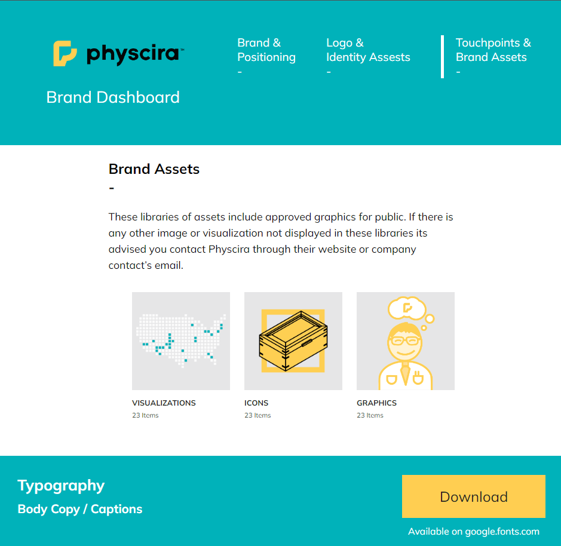

# Brand Dashboard Guide for Physcira

## Project Overview

The Brand Guide Navigation project is a web application that provides a user-friendly interface for navigating through a brand guide. The purpose of this project is to showcase a brand's positioning, logo and identity assets, and touchpoints and brand assets. It serves as a centralized hub for accessing and exploring various elements of a brand's guidelines.

The project utilizes HTML, CSS, and JavaScript to create a responsive and interactive user interface. It incorporates media queries to ensure optimal display and usability on different devices and screen sizes.

## Changelog

v1.0 (2022-10-14)
Initial release of Brand Dashboard

v1.01 (2023-01-23)
Fixed JavaScript bug with close button remaining open on resize

## Demo

Check out the live site here: [https://physcira.seancraigcreative.com/](https://physcira.seancraigcreative.com/)



## Technologies Used

- HTML
- CSS
- JavaScript

## Features

- Easy navigation between different sections of the brand guide.
- Responsive design that adapts to different screen sizes.
- Interactive elements for enhanced user experience.
- Contact information for support or inquiries.
- Logo with marked standard margins maintains ratio on resize.

## Project Structure

```
|-- index.html
|-- brand.html
|-- logo.html
|-- touchpoints.html
|-- signin.html
|-- css/
| |-- main.scss
| |-- main.css
| |-- main.css.map
|-- js/
| |-- script.js
|-- downloads/
| |-- PhysciraGraphics.zip
| |-- PhysciraIcons.zip
| |-- PhysciraLogos.zip
| |-- PhysciraVisualizations.zip
|-- fonts/
| |-- EBGaramond-Italic-VariableFont_wght.ttf
| |-- EBGaramond-VariableFont_wght.ttf
|-- images/
| |-- Graphics/
| | |-- Anatoliy_1-06.png
| | |-- Mission_Columns-06.png
| |-- Icons/
| | |-- Physcira-AcademyIcons_2-34.png
| | |-- Physcira-AcademyIcons_2-35.png
| | |-- Physcira-AcademyIcons_2-36.png
| | |-- Physcira-AcademyIcons_2-37.png
| | |-- Physcira-AcademyIcons_2-38.png
| | |-- square-icons-46.png
| | |-- square-icons-47.png
| | |-- square-icons-48.png
| | |-- square-icons-51.png
| | |-- square-icons-52.png
| | |-- square-icons-53.png
| |-- LogoAssets/
| | |-- Physcira_Logo_H_YW.png
| | |-- Physcira_Logo_ICON.png
| | |-- Physcira_Logo_PRIMARY.png
| | |-- Physcira_Logo_SECONDARY.png
| | |-- Physcira_Logo_V_W.png
| | |-- Physcira_Logo_V_YW.png
| | |-- Physcira_Logo_WHITE.png
| | |-- Physcira_Logomark_W.png
| |-- Visualizations/
| | |-- AmericanPastClientsMap_v7-01.png
| |-- arrow-right.svg
| |-- Arrow.png
| |-- Artboard1M.png
| |-- Artboard3M.png
| |-- close.png
| |-- DougHetzlerPhysicsBusRibbonCutting.jpg
| |-- DSC08329-isolated.jpg
| |-- menu.png
| |-- Physcira_Brand_Point1.jpg
| |-- Physcira_Folder.png
| |-- Physcira_logotouchpoint.jpg
| |-- physcirascreenshot.png
| |-- SCC_email-profile-01.png
| |-- SCC_Logo_FINAL-01.png
| |-- SCC_Logo_FINAL-WT-03.png
| |-- teacher-row-image.png
|-- README.md
```

## Development Process

Sean Craig Creative provided the project to me, and he already had a design. I focused on recreating the design on every detail, including typography and responsivity, all while providing constructive feedback. I utilized HTML to structure the content, CSS for styling and layout, and JavaScript for adding interactivity. The main challenge I faced was ensuring a responsive design that would provide a seamless experience across various devices. I addressed this challenge by implementing media queries and optimizing the layout for different screen sizes. I utilized flexbox for creating flexible and responsive layouts, and I used JavaScript to help handle navigation and the dropdown menu. Sean helped me understand a great deal about the process of putting a site together, file sharing, writing clean code, debugging, and somantic elements.

## Future Enhancements

In the future, I plan to add the following enhancements to the Brand Guide Navigation project:

- User Login feature that allows private brand information.
- Feature to dynamically load and update brand guide content for any brand, especially the logo and the color pallete.
- Enhanced search functionality to quickly find specific information within the brand guide.
- Interactive tutorials or tooltips to guide users through the brand guide navigation.
- Integration with social media platforms for easy sharing of brand assets.

## Getting Started

To run the Brand Guide Navigation project locally, follow these steps:

1. Clone the project repository: `git clone https://github.com/your-username/brand-guide-navigation.git`
2. Navigate to the project directory: `cd brand-guide-navigation`
3. Open the `index.html` file in a web browser.

## Usage

This project is not for public use.

## Contributing

Contributions to the Brand Guide Navigation project are currently not open. However, if you have any suggestions or feedback, feel free to reach out.

## License

All rights reserved. This project's code and content are protected under copyright law. You may not reproduce, modify, or distribute the code or content without explicit permission from the project author.

## Acknowledgments

- [Sean Craig Creative](https://seancraigcreative.com/) for design, inspiration, mentoring and support in creating this project.
- Fonts used: [Mulish](https://fonts.google.com/specimen/Mulish).
